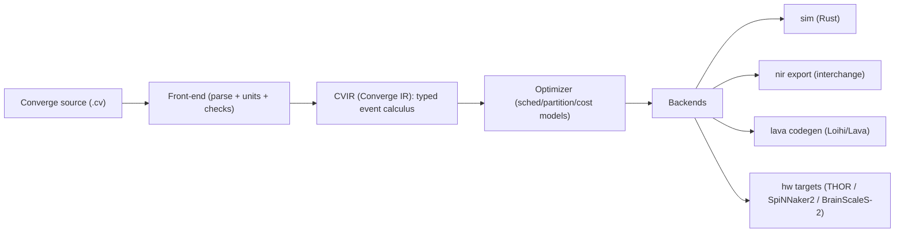

<p align="center">
  
</p>
<h1 align="center">Converge ❍</h1>
<p align="center"><strong>A time first language and toolchain for hybrid neuromorphic classical systems.</strong></p>

## What Converge is

Converge is a time first programming language and compiler toolchain for hybrid neuromorphic classical systems. It targets spiking networks event streams synaptic plasticity and the host code that orchestrates them.

It’s built around a simple insistence. Time isn’t metadata, it’s the program. Converge treats events delays and units as first class so you can compile the same intent into simulation interchange and hardware backends without rewriting the meaning.

Converge emits a canonical intermediate form called CVIR and it’s being shaped to align with NIR for ecosystem interchange. It’s early. The direction is not.

Status: pre alpha.

## Thesis

Neuromorphic systems don’t arrive as a single chip and a single SDK. They arrive as fabrics. You’ve got event based sensors, host control loops, routing constraints, quantization rules and timing jitter. If your program can’t name time precisely, you’ll be debugging folklore.

Converge is not a Python SNN library replacement. It’s a compiler toolchain that makes time explicit, makes artifacts inspectable and keeps execution deterministic enough to ship.

## Design principles

1. Time is explicit in source and in IR.
2. Units are part of meaning and they can’t be shrugged off.
3. Determinism is a feature, not a nice to have.
4. If you can’t inspect it, you can’t deploy it.
5. Hardware comes later, semantics come first.
6. Interop is mandatory, not aspirational.

## Architecture



Today you’ve got the front end plus a validator and a CVIR JSON emitter. Next you’ll get a deterministic simulator core then an interchange pipeline and finally hardware codegen.

## Quick start

You need Rust stable. Minimum supported Rust is 1.92.

```bash
cargo test
cargo run -p converge-cli -- check examples/hello.cv
cargo run -p converge-cli -- ast   examples/hello.cv
cargo run -p converge-cli -- cvir  examples/hello.cv
```

## Docs

1. `docs/spec.md` current accepted grammar and validation rules
2. `docs/references.md` curated anchors for hardware and interchange
3. `docs/voice.md` writing rules for project docs
4. `docs/brand.md` logo and asset guidance

## Origin

Converge is conceived by Eros Marcello (founder of ethereal computing inc.) and it’s being built in open collaboration with AI tooling. You’ll see that stance in the artifacts. The repo is designed to be read, not just executed.

## Contributing

Read `CONTRIBUTING.md` then pick something small and make it sharp. If you add syntax you’ll add tests and you’ll keep the IR stable.

## Security

Read `SECURITY.md` for reporting. Converge will support defensive robustness testing and fault injection. It won’t ship offense code.

## License and contact

MIT. See `LICENSE`. Open an issue or email eros@etherealcomputing.com
