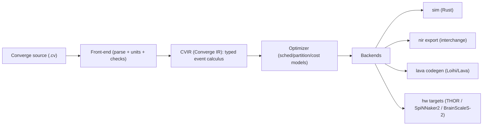

# Converge

Converge is a **time‑first programming language + toolchain** for building **hybrid neuromorphic–classical systems**: spiking networks, event streams, synaptic plasticity, and the host code that orchestrates them.

It’s inspired by the *whole‑stack audacity* of projects like TempleOS/HolyC — not in aesthetics, but in ethos:

- **One coherent stack** you can hold in your head: language → compiler → IR → simulator → hardware backends.
- **Explicitness over magic**: time, units, delays, learning rules, and IO are first‑class.
- **Inspectable artifacts**: compilation emits human‑readable IR and deterministic reports.

Status: **pre‑α** (this repo is the start of the compiler/runtime).

---

## Why this exists

Neuromorphic systems are arriving as **heterogeneous fabrics** (digital SNN chips, mixed‑signal accelerated-time systems, event-based sensors, and hybrid cloud access), and they increasingly live inside **classical control loops**. The painful part is not “writing a network” — it’s:

- **Time semantics** (discrete vs event-driven; delays; scheduling).
- **Hardware partitioning** (what runs on the host vs the neuromorphic fabric).
- **Interchange** between ecosystems (simulation, training, deployment).
- **Reproducibility** (randomness, quantization, routing constraints, and timing).

Converge’s bet: treat *time and events as the IR*, then compile down into whatever “fabric” you have.

---

## The Converge stack (current direction)



**CVIR** is intentionally shaped to align with **NIR (Neuromorphic Intermediate Representation)** for ecosystem interchange.

---

## Language at a glance (fabric DSL)

Converge’s “fabric” layer is declarative: you describe neuron models, populations, connectivity, learning rules, and time.

```converge
neuron LIF {
  tau_m = 20 ms
  v_th  = 1.0 V
}

layer Input[100]  : LIF
layer Hidden[300] : LIF
layer Output[10]  : LIF

connect Input  -> Hidden { w = Uniform(-1.0, 1.0)  d = Normal(1 ms, 0.1 ms) }
connect Hidden -> Output { w = Uniform(-1.0, 1.0)  d = Normal(1 ms, 0.1 ms) }

run for 1 s
```

**Important:** the compiler/runtime will ultimately support both *event-driven* and *clocked* execution, but the semantics will remain *time-explicit* in source and IR.

---

## Quick start (today)

You need Rust (`rustc`/`cargo`).

```bash
cargo run -p converge-cli -- check examples/hello.cv
cargo run -p converge-cli -- ast   examples/hello.cv
```

---

## Scope (what Converge is / isn’t)

Converge is not “yet another Python SNN library”. It’s a **compiler toolchain** meant to:

- Represent neuromorphic programs in a **hardware-agnostic** but *timing-precise* IR.
- **Partition** across a host CPU/GPU and neuromorphic fabric (hybrid arrays).
- Emit **multiple deployment targets** (simulators, interchange formats, vendor SDKs).

Converge does *not* try to replace existing ML ecosystems. Instead it aims to be the missing bridge layer:
source → IR → (NIR/Lava/…).

---

## Ecosystem alignment (bleeding edge references)

Hardware and platforms Converge is designed to target (over time):

- **Intel Loihi 2 / Hala Point** neuromorphic system (Loihi 2–based, large-scale SNN hardware).
- **SpiNNaker2** (many-core, event-driven neuromorphic platform; e.g., SpiNNcloud deployments).
- **BrainScaleS‑2** (mixed-signal neuromorphic with accelerated-time dynamics).
- **Neuromorphic Commons (THOR)**: shared access to neuromorphic systems for researchers.

Software ecosystems Converge will interoperate with rather than replace:

- **Lava** (Intel’s neuromorphic software framework).
- **NIR (Neuromorphic Intermediate Representation)** as the interchange layer between frameworks/hardware.
- **Nengo**, **Brian2**, **Norse**, **snnTorch** (simulation/training ecosystems Converge can exchange with via IR and codegen).

See `docs/references.md` for links and short notes.
See `docs/spec.md` for the current accepted grammar (pre‑α).

---

## Security & robustness (responsible research)

Neuromorphic systems need the equivalent of “fuzzing + fault injection + timing adversaries”.
Converge intends to support **pathology-inspired robustness testing** (e.g., timing jitter, spike corruption, routing congestion, state rollback) as *first-class simulation modes*.

This is for defensive engineering and scientific study. No “malware DSL” lives here.

---

## Roadmap (high-level)

- **0.1**: parser + AST + validation + stable diagnostics
- **0.2**: CVIR + deterministic simulation kernel (LIF + basic synapses)
- **0.3**: NIR export/import
- **0.4**: Lava codegen backend (Loihi/Lava workflows)
- **0.5**: partitioning + scheduling cost models (hybrid host/fabric)

---

## License

MIT. See `LICENSE`.

## Contact

Open an issue, or email eros@blackdream.ai.

